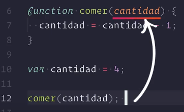
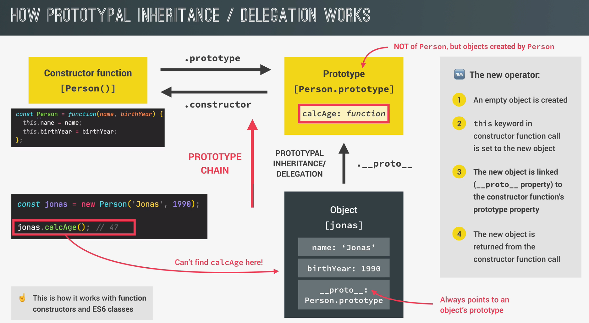

<div align = "center">
  <h1> JavaScript </h1>
</div>

<div align = "center">
  
</div>

<hr>

## Table of Contents

- [How to open the inspector tools in Chrome](#how-to-open-the-inspector-tools-in-chrome)
- [Brief introduction to JavaScript](#brief-introduction-to-javascript)
- [Values and Variables](#values-and-variables)
- [Variable Naming Conventions](#variable-naming-conventions)
- [Types Of Operators](#types-of-operators)
- [Operator Precedence](#operator-precedence)
- [Template literals (Template strings)](#template-literals-template-strings)
- [Control Structures](#control-structures)
- [Statements and Expressions](#statements-and-expressions)
- [VAR, LET or CONST: Which should I use?](#var-let-or-const-which-should-i-use)
  - [Compatibility](#compatibility)
  - [Scope](#scope)
  - [Reassignment](#reassignment)
  - [Redeclaration](#redeclaration)
  - [Declaration Without Initial Value](#declaration-without-initial-value)
  - [Global Object Property](#global-object-property)
  - [Hoisting](#hoisting)
  - [Conslusion](#conslusion)
- [Data Types](#data-types)
  - [Primitive Types](#primitive-types)
    - [String](#string)
    - [Number](#number)
    - [Boolean](#boolean)
      - [Falsy Values](#falsy-values)
      - [Checking for falsy values on variables](#checking-for-falsy-values-on-variables)
      - [General Examples](#general-examples)
      - [Fun With Arrays](#fun-with-arrays)
      - [Caveat](#caveat)
    - [Null](#null)
    - [Undefined](#undefined)
    - [Symbol](#symbol)
    - [BigInt](#bigint)
- [Strings](#strings)
- [Arrays](#arrays)
- [Objects](#objects)
- [For Loop](#for-loop)
- [While Loop](#while-loop)
- [Destructuring assignment](#destructuring-assignment)
- [Short Circuiting (\&\& and ||)](#short-circuiting--and)
- [Nullish coalescing operator (??)](#nullish-coalescing-operator)
- [Logical OR assignment (||=)](#logical-or-assignment)
- [Logical nullish assignment (??=)](#logical-nullish-assignment)
- [Bitwise AND assignment (\&=)](#bitwise-and-assignment)
- [Enhanced Object Literals](#enhanced-object-literals)
- [Optional chaining (?.)](#optional-chaining)
- [Set](#set)
- [Map](#map)
- [Strict Mode](#strict-mode)
  - [Why do the 'strict mode' and the 'sloppy mode' exist?](#why-do-the-strict-mode-and-the-sloppy-mode-exist)
  - [What changes on 'strict mode'?](#what-changes-on-strict-mode)
- [Values vs References](#values-vs-references)
- [Type Systems](#type-systems)
  - [Type checking](#type-checking)
  - [Type Requirement](#type-requirement)
  - [Type Conversion](#type-conversion)
    - [To a string (if the value is neither null nor undefined)](#to-a-string-if-the-value-is-neither-null-nor-undefined)
    - [To a number](#to-a-number)
    - [To a boolean](#to-a-boolean)
  - [Type Equivalence or Compatibility](#type-equivalence-or-compatibility)
  - [TypeScript](#typescript)
- [== vs ===](#-vs-)
  - [When to use (strict equality operator)](#when-to-use-strict-equality-operator)
  - [When to use (loose equality operator)](#when-to-use-loose-equality-operator)
- [Functions](#functions)
  - [Arrow Function Expressions](#arrow-function-expressions)
- [OOP In JavaScript](#oop-in-javascript)
- [Asynchronous JavaScript](#asynchronous-javascript)
- [Ways To Store Data Inside Of A Browser](#ways-to-store-data-inside-of-a-browser)
- [Closer Look Into Functions](#closer-look-into-functions)
- [JavaScript Engine and Runtime](#javascript-engine-and-runtime)
  - [Compilation VS Interpretation](#compilation-vs-interpretation)
  - [Modern JUST-IN-TIME compilation of JavaScript](#modern-just-in-time-compilation-of-javascript)
  - [JavaScript Runtime](#javascript-runtime)
- [Execution Contexts And The Call Stack](#execution-contexts-and-the-call-stack)
  - [Execution Context In Detail](#execution-context-in-detail)
- [Scoping and Scope In JavaScript](#scoping-and-scope-in-javascript)
  - [The 3 Types Of Scope](#the-3-types-of-scope)
- [How the `this` keyword works](#how-the-this-keyword-works)
- [Regular Functions VS Arrow Functions](#regular-functions-vs-arrow-functions)
- [Primitive vs Reference Value](#primitive-vs-reference-value)
- [First-Class and Higer-Order Functions](#first-class-and-higer-order-functions)
- [Closures](#closures)
- [Data Transformations map, filter, reduce](#data-transformations-map-filter-reduce)
- [Working with arrays](#working-with-arrays)
- [What is Object Oriented Programming](#what-is-object-oriented-programming)
- [Classes and instances](#classes-and-instances)
- [The 4 fundamental OOP principles](#the-4-fundamental-oop-principles)
- [How does OOP actually works in JavaScript](#how-does-oop-actually-works-in-javascript)
- [What is a Generator Function, Provide A Use Case](#what-is-a-generator-function-provide-a-use-case)

Extra Important Official References

- [General JavaScript guidelines](https://developer.mozilla.org/en-US/docs/MDN/Guidelines/Code_guidelines/JavaScript#general_javascript_guidelines)
- [JavaScript reference](https://developer.mozilla.org/en-US/docs/Web/JavaScript/Reference)

# How to open the inspector tools in Chrome

There are 3 ways to accomplish that:

1. command + option + i (MacOS), control + alt + i (Windows)
2. right click and then select option "inspect"
3. **On Chrome**: Click on View -> Developer -> Developer Tools
4. **On Firefox**: Click on Tools -> Browser Tools -> Web Developer Tools
5. **On Microsoft Edge**: Click on Tools -> Developer -> Developer Tools
6. **On Opera**: Click on Developer -> Developer Tools

# Brief introduction to JavaScript

JavaScript is a high-level, prototype-based object oriented, multi-paradigm, interpreted or just-in-time compiled, dymanically-typed, single-threaded, garbage-collected programming language with first-class functions and a non-blocking event loop concurrency model.

Let's deconstruct this to make a little more sense:

- **Programming Language**: It's a tool that allow us to write code that will instruct a computer to do something.
- **High-Level**: Every program that runs on your computer needs some hardware resources such as memory, and a CPU to do its work. Now, there are low-level languages such as _C_, where you have to manually manage these resources. For example, asking the computer for memory to create a new variable. On the other hand, you have high-level languages such as _JavaScript or Python_ where we don't have to manage resources at all, because these languages have so called **_abstractions_** that take all of that work away from us. Those things make the language easier to write and learn but, the downside is that program would never be as fast or as optimized as _C_ programs.
- **Garbage-collected**: This is one of the powerful tools that takes _Memory Management_ away from us. It's basically an algorythm inside the JavaScript engine which automatically removes all unused objects from the computer's memory in order not to clog it up with unneccesary stuff. So, it's a little bit like JavaScript has a cleaning guy who cleans out memory from time to time so that we don't have to do it manually in our code.
- **Interpreted or _just-in-time_ compiled**: The computer processor only understands _0_ and _1_, which is also called _machine code_ and since it's not practical to write, we simply write human-readable JavaScript code which is an abstraction over machine code. But this code, eventually needs to be translated to machine code, and that step can be either compiling or interpreting. This step is neccesary in every programming language, which in JavaScript, it happens inside the JavaScript Engine.
- **Multi-Paradigm**: In programming, a **_paradigm_** is an approach and mindset of structuring our code, which will direct your coding style and technique. Three popular paradigm are:

  1. Procedural Programming:

  It's a programming paradigm built around the idea that programs are sequences of instructions to be executed. They focus heavily on splitting up programs into named sets of instructions called procedures, analogous to functions.

  2. Object Oriented Programming (OOP):

  Object-oriented programming is a programming paradigm that organizes data and the software structure based on the concept of classes and objects.

  Classes are a set of instructions (or blueprints) that establish a data structure for a specific object, determining what the object will contain (the types of variables that can exist in an object) and how it will behave (the methods or member functions that define how to operate on the variables). Thus, objects are instances of classes since classes work as "templates" to create objects. Plus, objects can contain data in the form of fields (also known as attributes) and code in the form of procedures (also named methods).

  3. Functional Programming (FP)s:

  It's a method of writting applications by using **functions** that avoid **shared state and mutable data**. It is an **essential concept in JavaScript**.

  When talking about functional JavaScript, **4 main concepts** should come to mind:

  1. **_Pure functions_**: Functions that return the same output given a specific input.
  2. **_Higher-Order Functions_**: Functions that receive another function as a parameter or have a function as a return value.
  3. **_Avoiding Side Effects_**: Side Effects are mutations or actions that happen in our code that we cannot keep into account or predict
  4. **_First-Class Objects_**: JavaScript functions are actually objects, meaning we can work with them the same as a variable; assign them to a variable, pass them as argument, return them, include them in different data structures.

They can be clasified between _imperative_ and _declarative_.

JavaScript is so flexible and versatile that we can use all kind of different programming styles such as imperative and declarative programming, and these different styles are different ways to structure our code basically.

- **Object-Oriented**: About this nature, it is a prototype-based object-oriented approach. What does that mean?

  1. Almost everything in JavaScript is an object except for primitive values. Now, have you ever wondered why we can create an array and then use the _push_ method on it for example? Well, it's because of the _prototypal inherintance_. Basically, we create arrays from an array blueprint, which is like a template, and this is called the _prototype_; This prototype contains all the array methods, and the arrays we create in our code then inherit the methods from the blueprint, so that we can use them on the arrays.

- **First-class Functions**: In a language with first-class functions, functions are simply **treated as regular variables**. We can pass them into other functions, return them from functions and even assign them to a variable.
- **Dynamically-Typed**: In JavaScript we don't assign data types to variables, instead they only become known when the JavaScript engine executes our code. Also, the type of variables can easily be changed when we re-assign variables.

What is a **_concurrency model?_** Well, it's just a fancy name that means how the JavaScript Engine handles multiple tasks happening at the same time. Okay, that's cool but, why do we need that?

- **Single-Threaded**: JavaScript has only one call stack that is used to execute the program, which means that it can only do one thing at a time. In computing, _a thread_, is like a set of instructions that is executed in the computer's CPU. So, basically the thread is where our code is actually executed in a machine's processor.

- **Non-Blocking**: Refers to code that doesn't block the execution of the program. What about if there's a long-running task (like fetching data from a remote server)? it sounds like it would block the single thread. However, we want non-blocking behaviour. Then, how do we achieve that? By using an **event loop**: it takes long running tasks, executes them in the "background", and puts them back in the main thread once they're finished.
  - **Asynchronous Code Definition**: Asynchronous code allows the program to be executed immediately where the synchronous code will block further execution of the remaining code until it finishes the current one.

# Values and Variables

- **Value**: It's basically a piece of data so, it's the most fundamental unit of information that we have in programming. For example:

```JavaScript
'Victor'
23
```

- **Variable**: Variable means anything that can _vary_. In JavaScript, a variable stores the data value that can be changed later on. Imagine a box (space in memory), within it you can hold some object, for example a book, and we can then write a label on the box to describe what's in it. Later on, when needed, we can find that object by using the label.

To get into more understanding about decalring variables in JavaScript, please see [MDN Web Docs References.](https://developer.mozilla.org/en-US/docs/Web/JavaScript/Guide/Grammar_and_types#declarations)

```JavaScript
// Syntax
var <variable-name>;
var <variable-name> = <value>;

// Example
var firstName = 'Victor';
```

# Variable Naming Conventions

1. They must be written using `lowerCamelCase` notation. Important: Do not start a variable with an uppercase letter. That's not illegal, it's just that this kind of variable names are for a specific use case which is Object Oriented Programming. [See Reference](https://developer.mozilla.org/en-US/docs/MDN/Guidelines/Code_guidelines/JavaScript#variables)
2. You cannot use keywords from the language such as `new` or `function`.
3. You are only able to use `$`, `_` , `numbers` and `letters` to declare them, and they cannot start or use any special character.
4. Declare only constants using all uppercase letters (it's a convention).
5. Always make **descriptive** the name for variables so, it provides a notion of what it holds.

# Types Of Operators

- [Types Of Operators](https://developer.mozilla.org/en-US/docs/Web/JavaScript/Guide/Expressions_and_Operators#operators)

# Operator Precedence

- [Operator Precedence](https://developer.mozilla.org/en-US/docs/Web/JavaScript/Reference/Operators/Operator_Precedence)

# Template literals (Template strings)

- [Template literals (Template strings)](https://developer.mozilla.org/en-US/docs/Web/JavaScript/Reference/Template_literals)

# Control Structures

- [if statement](https://developer.mozilla.org/en-US/docs/Web/JavaScript/Reference/Statements/if...else)

- [Conditional (ternary) operator](https://developer.mozilla.org/en-US/docs/Web/JavaScript/Reference/Operators/Conditional_Operator)

- [Switch Statement](https://developer.mozilla.org/en-US/docs/Web/JavaScript/Reference/Statements/switch)

- [Statements and declarations](https://developer.mozilla.org/en-US/docs/Web/JavaScript/Reference/Statements)

# Statements and Expressions

All programming languages have _**language syntax**_. It is a set of rules that define how we can combine different symbols to _**produce valid instructions**_ in order _**to create a program**_ that the _**computer understands**_. A computer can't understand a program if it doesn't comply with the language syntax we are using.

In JavaScript we have two syntactic structures to create programs:

An _**expression**_ is a unit of code that produces a value when evaluated, for example: we can compare them with the "words" in the Spanish language.

Let's suppose we have to assign a value to a variable, how do you think we can complete that line of code? Let's start with the most basics:

1. **Primary Expressions**:
   Any small word that produces a value by itself. Yes, any primitive value is a good example.

```JavaScript
                                  'texto'
                                  true
                                  false
                                  null
                                  undefined
                                  Symbol('foo')
                                  90099839723042342234n

```

we can also use certain _reserved words_ of the language like _this_, or the name of other variable. All of them are _**primary expressions**_ since with a single word we are producing a single value.

Another expressions we can use are: _**Objects and arrays**_. On each position of the array we have to define a _**value**_, or something that _**produces a value**_, an expression. The same happens with the object: keys are generally strings that do not need _quotes ('', "")_ if the dont have _blank spaces_ in between, and its values are expressions.

2. **Function Expressions**:
   When we write a function in the part of the code where we're expecting a value.

```JavaScript
                      const func = () => console.log('Hello!');
                      numeros.filter(function filtrarPares(number) {
                        return number % 2 === 0;
                      });
```

3. **Object Properties**:

```JavaScript
                          let unaVariable;
                          const miObjeto = { nombre: 'Sacha' };
                          const miArray = [1, 2 ,3];

                          unaVariable = miObjeto['nombre'];
                          unaVariable = miArray[0];
```

4. **Function Invocation**:
   In JavaScript when we invoke a function we will always have a back a _value_ as a return.

On the other hand, we have _**statements**_. They are **actions** that are executed so the programs carries on the logic we want it to perform.

We can compare it with a normal spoken language: a _statement_ is like a complete sentence and, an _expressions_ are the words that make up that sentence.

```JavaScript
                  if (23 > 10) {
                    const str = '23 is bigger'; //This is an expression
                  }
          //NOTE: This 'statement' does not really produces a value, does it?
```

Now, this difference between expressions and statements is important to know because JavaScript expects statements and expressions in different places. For example, in a template literal we can only insert expressions but not statements

```JavaScript
          console.log(`I'm ${2037 - 1991} years old.`); // This would work
    console.log(`I'm ${if (23 > 10) const str = "23 is bigger"} years old.`);
    // This 👆🏻 won't work. It doesn't even make sense to do something like that.
```

# VAR, LET or CONST: Which should I use?

In order to follow the best approach, you should be using them exactly on this order:

```JavaScript
  const > let > var
```

Now, let's compare their main caracteristics so you can really understand why we should use `const` over `let` and `let` over `var`.

## Compatibility

`var` is the old way to declare variables, since it is present from the beginning of the language (1995). Now, since `ES2015`, it was introduced `let` and `const` as alternatives to declare variables in order to solve the problem that `var` has.

Can we just use `let` and `const` without overthinking?

if we check the compatibility of both of them on the site [https://caniuse.com/](https://caniuse.com/):

- [let](https://caniuse.com/?search=let)
- [const](https://caniuse.com/?search=const)

we'll see that we can use them in the majority of the modern web browsers without any issue except for `Opera Mini` which currentlt has incompatibilities. And in `Node.js` they can use used from the version `6.4.0`

- [let](https://node.green/#ES2015-bindings-let)
- [const](https://node.green/#ES2015-bindings-const)

To summarize, `var` can be used on any environment but `let` and `const` have incompatibilities with certain version of browsers (in case we're using babel to compile our projects we are covered)

## Scope

Variables declared with `var` have `function scope`

```JavaScript
function greet() {
  var name = 'Victor';
  console.log(`Hola ${name}`);
}
```

in this example, `name` is only `accesible` inside `greet function`. We can't do this

```JavaScript
function greet() {
  var name = 'Victor';
  console.log(`Hola ${name}`);
}

console.log(name)
```

since it will throw

```
"ReferenceError: name is not defined"
```

Variables declared with `let` and `const` are going to have a `block scope`. Which means, every portion of code surrounded by `{}`

```JavaScript
function divide() {
  let result = [];

  for (let i=0; i < numbers.length; i++) {
    let number = numbers[i];
    let half = numero / 2;
    result.push(half);
  }

  return result;
}
```

the good thing about them is that in the case we have the same variable declared in different blocks of code

```JavaScript
function divide() {
  let result = [];
  let number = 42;

  for (let i=0; i < numbers.length; i++) {
    let number = numbers[i];
    let half = numero / 2;
    result.push(half);
  }

  console.log('number ', number); // 42

  return result;
}
```

we will not lose the value of the first one. But, in case we want to access any of the variables inside the `for loop` outside, this is what's going to happen

```JavaScript
function divide() {
  let result = [];
  let number = 42;

  for (let i=0; i < numbers.length; i++) {
    let number = numbers[i];
    let half = numero / 2;
    result.push(half);
  }

  console.log('number ', number); // 42
  console.log('half ', half); // ReferenceError: half is undefined.

  return result;
}
```

## Reassignment

Varibles declared with `const` can't be re-assigned. `cont` serves to declare variable in a `block scope` that can't be re-assigned.

```JavaScript
const name = 'Victor';
name = 'John'; // TypeError: Assignment to constant variable
```

it is a `constant variable` but heads up: the fact the is a constant <u>doesn't mean</u> that it's value is immutable.
As you may recall, `primitive values are immutable`.

## Redeclaration

What would happen if inside a scope we re-declare a variable with an existing name?

In case we do it with `var`, nothing will happen

```JavaScript
function greet(name) {
  var greeting = 'Hola';
  var greeting = 'Hello';

  console.log(`${greeting} ${name}`);
}
```

but is case we use `let` or `const` instead, this is what will happen

```JavaScript
function greet(name) {
  let greeting = 'Hola';
  let greeting = 'Hello';
  // SyntaxError: Identifier 'greeting' has already been declared.

  console.log(`${greeting} ${name}`);
}

function greet(name) {
  const greeting = 'Hola';
  const greeting = 'Hello';
  // SyntaxError: Identifier 'greeting' has already been declared.

  console.log(`${greeting} ${name}`);
}
```

what we **can do** is to declare another variable with the same name but `inside another scope`

```JavaScript
function greet(name) {
  let greeting = 'Hola';

  if (name === 'Victor') {
    let greeting = 'Hello';
    console.log(`Here the greeting ${greeting}, ${nombre}`);
  }

  console.log(`${greeting} ${name}`);
}
```

## Declaration Without Initial Value

In case we declare a variable by using `var` or `let` without defining it, by default, JavaScript will assign the value `undefined` to it.

As you may know, we can not assign a new value to variables declared with `const`, essentially because of its nature, they are `constants`, and it doesn't make sense to declare a constant without a value because we won't be able to assign it one.

```JavaScript
const name;
name = 'Victor'; // This can't be done
```

However, JavaScript won't let us declare a constant without assigning it a value. It will be thown this error

```
SyntaxError: Missing initializer in const declaration
```

## Global Object Property

If we declare a globally a variable using `var`

```JavaScript
var name = 'Victor';
name === window.name // true
```

this will be added as a property of the Global Object `Window`.

In the case of `let` or `const`

```JavaScript
let name = 'Victor';
```

```JavaScript
const name = 'Victor';
```

they will be globally declared if we defined them outside of all blocks of code or functions but they won't be added as properties of the Global Object `Window`.

## Hoisting

`Hoisting` in Spanish translates into `Elevación`, and in JavaScript when we use that term, generally we refer that when we declare variables with `var` inside of a function, it doesn't matter where in the code we've done it, the JavaScript interpreter will do this: It will separate the variable declaration and it's going to elevate to where the scope starts, but just its declararion, its assginment will be left in the same place. This is something internally done by the interpreter at runtime, it's just the way JavaScript reads the code.

If we'd like, we would access the variable before its initialization and we'd see its value. It is one of the strangest parts that JavaScript has and that can cause confusion.

With the variables delcared with `let` and `const` the `Hoisting` works differently. We can't access the variable before its initialization, if we attempt it we'll get this error

```JavaScript
console.log(name);
const name = 'Victor';
// ReferenceError: Cannt access 'name' before initialization
```

and what would happen on this case? when the `console.log(name)` is read

```JavaScript
const name = 'Victor';

if (true) {
  console.log(name);
  const name = 'Peter';
}
// ReferenceError: Cannt access 'name' before initialization
```

what happens in the case of `let` and `const` is that the interpreter is going to read our code and it's also going to separate the variable declaration and elevate it of the start of the scope where it belongs but, they won't be defined as `undefined` but instead, they will be **_marked_** as **_uninitialized_**.

Something also different is that the block that is composed by all the lines of code that go from the beginning of the block until the line where variables are initialized, is called `Temporal Dead Zone`. That means that we won't be able to access a variable before its declaration.

The `temporal dead zone` refers to the period between the entering of the scope (lexical scope) and the declaration of a variable using let or const keywords. During this temporal dead zone, if you try to access the variable, a `ReferenceError` will be thrown. In other words, it is a region of code where a variable cannot be accessed because the program execution has not yet reached the line of code where it is declared.

And this is another reason why we should use `let` and `const` over `var`. The `hoisting` is a very strange behavior, in which case would we want to access a variable that hasn't been declared yet?

Declarations with `var` are hoisted but, with `let` and `const` variables go into the TDZ from the beginning of the block until the line of code where assignment takes place.

## Conslusion

`const` it's a signal that a particular variable can't be re-assigned. It's going to force us to write a **cleaner code.**

`let` we'll use it to convey that a variable can be re-assigned. In general, we use it to **iterate over for loops** or when there's no other option.

`var` doesn't tell us that much. It won't give us any signal about how the variables should be used. It can represent either a constant or a variable that can be re-assigned. It could serve to declare variables inside a block or a function, which is confusing and highly prone to introduce bugs.

# Data Types

JavaScript has a `dynamic type` which means that variables don't have to manually define the data type of the value they store. Instead, data types are determined **automatically**. The distinction between `value` and `variable` is pretty important, because in JavaScript is the _**value**_ that has a type, not the variable. So, variables simply store values that have a type. We also can assign a new value with a different data type to the same variable previously defined without a problem.

It also has a `weak type`, which means that we can perform computations among values of different types. Under the hood, JavaScript would make its best effort to concrete the computation you want to perform, making an implicit data type conversion called `Type Coertion` ([see referencee](https://www.freecodecamp.org/news/js-type-coercion-explained-27ba3d9a2839/)) and it has a great impact on how our programs are executed. The data type of a variable is determined when is exceuted the line of code that contains it. It depends on the operation that is being perfomed with it.

```JavaScript
                                      2 + '1' = 21
                                      1 - '2' = -1
```

Due to its particular characteristics, there are two groups of data types:

1. Primitive Types (Number, String, Boolean, Undefined, Null, Symbol and BigInt)
2. Object Types (Arrays, functions, dates, regular expressions and any literal object)

## Primitive Types

They are basic, immutable values that contain neither methods nor properties.

```JavaScript
          /*If we are in the browser's console*/
          var numero = 2;
          numero.name = "number two";
          numero.name;
          undefined; //the assignment of the new property didn't work

          var text = "Cocina";
          text[0] = "B";
          text //we access the variable
          "Cocina"

          text = "Bocina";
          text //we access the variable
          "Bocina"
```

### String

1. They allows to represent texts in our programs.
2. They are defined between 2 `doble` or `single` quotes. The important thing here is that we have to use them consistently `'string'` or `"string"` not `'string"`.
3. In ES2015, was introduced another character: the `backtick`. This allows to interpolate a variable or expression within the string:

```JavaScript
              let saludo = `Hola, me llamo ${nombre} ${apellido}.`
```

4. In order to represent them, JavaScript implements an encoding called UTF-16, what allows us to represent characters from many languages, even emojies.
5. There is a string which does not contain length and is called `empty string : ''` and it's mainly used to provide a initial value to a variable.
6. To be able to obtain a string from a varible, it is possible to access the toString() method

```JavaScript
                              "29".toString() = "29"
```

<i>Note: If we use this method we have to make sure that the variable does not contain either `null` or `undefined`. Otherwhise we will get an TypeError: Cannot read property 'toString' of null</i></br></br>

or concatenate it with the empty string

```JavaScript
                                  29 + '' = '29'
```

### Number

They are so called floating point numbers, which means that they always have decimals even if we don't see them of define them.

1. They allow us to represent numbers: positive, negative and decimal.
2. When it comes to repesent numbers, JavaScript is not accurate

```JavaScript
                           0.1 + 0.2 = 0.30000000000000004
```

or

```JavaScript
        +(0.1 + 0.2).toFixed(40) = 0.3000000000000000444089209850062616169453
```

this behavour also happens in Python, Ruby o Java as well.

This has to do with the way numbers are designed within the programming language, it is used a format called `IEEE 754` and by using it each number takes 64bits (8bites) in memory.

3. The range of numbers we can use on this format goes after

```JavaScript
                          -(2 ** 53) + 1 and (2 ** 53) - 1
```

we can represent numbers beyond those limits, but they are going to be approximations, and if we perform operations with them we will get unexpected results.

```JavaScript
                      numeroMinimo === Number.MIN_SAFE_INTEGER
```

```JavaScript
                          minNumber === Number.MIN_VALUE
```

```JavaScript
                      numeroMaximo === Number.MAX_SAFE_INTEGER
```

```JavaScript
                          maxNumber === Number.MAX_VALUE
```

they limit the range of numbers it which is safe to perform numeric operations, and to verify a number is within the limits we can use

```JavaScript
                        Number.isSafeInteger(19080) === true
```

4. There are two values of type number that goes beyond those numbers

```JavaScript
                  Inifity === number/0 and -Infinity === number/-0
```

any number is not greater of smaller the both of them, they represent approximations.

5. If we make 0/0 we'll get

```JavaScript
                                        NaN
```

it's type number and is what we get when is perfomed an invalid computation.

```JavaScript
                        "hola"/3 === NaN or NaN + 30 === NaN
```

but we have a method to verify it

```JavaScript
                                isNaN(30) ---> false
                                isNaN(NaN) ---> true
```

it's a very special value in JavaScript, it's not equal to anything even itself

```JavaScript
                                NaN === NaN ---> false
```

6. To verify that a number is finite or not we use this method

```JavaScript
                                isFinite(300) === true
                            isFinite(Infinity) === false
```

### Boolean

It's a logical type which can only be _true_ or _false_

1. Used for taking decisions.
2. Values evaluated to `false`: `""`, `0`, `null`, `undefined` and `NaN`. Any other value evaluates to `true`. (they're called 'falsy values')+

   #### Falsy Values

   A falsy value is something which evaluates to FALSE, for instance when checking a variable. There are only six falsy values in JavaScript: `undefined`, `null`, `NaN`, `0`, `""` (empty string), and `false` of course.

   #### Checking for falsy values on variables

   It is possible to check for a falsy value in a variable with a simple conditional

   ```JavaScript
   if (!variable) {
    // When the variable has a falsy value the condition is true.
   }
   ```

   #### General Examples

   ```JavaScript
    var string = ""; // <-- falsy
    var filledString = "some string in here"; // <-- truthy
    var zero = 0; // <-- falsy
    var numberGreaterThanZero // <-- truthy
    var emptyArray = []; // <-- truthy, we'll explore more about this next
    var emptyObject = {}; // <-- truthy
   ```

#### Fun With Arrays

```JavaScript
  if ([] == false) // <-- truthy, will run code in if-block
  if ([]) // <-- truthy, will also run code in if-block
  if ([] == true) // <-- falsy, will NOT run code in if-block
  if (![]) // <-- falsy, will also NOT run code in if-block
```

#### Caveat

Be aware of the data type when evaluating a value in a Boolean context. If the data type of the value is meant to be a number, the truthy/falsy evalution can result in an unexpected outcome:

```JavaScript
const match = { teamA: 0, teamB: 1 }
if (match.teamA) {
  // The following won't run due to the falsy evaluation
  console.log('Team A: ' + match.teamA);
}
```

An alternative to the use case above is to evaluate the value using `typeof`

```JavaScript
const match = { teamA: 0, teamB: 1 }
if (typeof match.teamA === 'number') {
  console.log('Team A: ' + match.teamA);
}
```

### Null

1. It allows to represent the absence of value, it comes handy when whe want to define that a variable is empty or that we do not know its value yet. We can use it to assign a initial value to a variable.
2. `Null` is a primitive data type even though that the typeof operator returns `object`.

### Undefined

1. It means _**unknown data type**_. It's the value that is automatically given to a variable when is declared but not assigned a value. It's a data type different from `null`.
2. `Undefined` means:

- A variable was not given a value.
- It was not received a param.
- A function call finished without returning a value.

### Symbol

To be reviewed

### BigInt

1. It allows us to write integer numbers without limit.
2. To use is we basically write the number we want to use and add it an `n` at the end. Like follows:

```JavaScript
   let numeroGrande = 8927345254435334599065n
```

we can also use the `Bigint` function to create them based on numbers or strings.

```JavaScript
          let numeroGrande2 = BigInt('8927345254435334599065')
```

How is it that we can do something like this:

```JavaScript
                      let name = "Victor";
                      name.toUppercase()
                      "VICTOR"
```

when we just said that primitive values don't have neither _properties_ or _methods_?

That's because the data types

```JavaScript
                              boolean
                              number
                              string
```

have their equivalents in the object's. For instance:

```JavaScript
                  let name = new String('Victor')
                  name
                  String {"Victor"}

                  let isAGoodDay = new Boolean(true)
                  isAGoodDay
                  Boolean {true}

                  let number = new Number(10)
                  number
                  Number {10}
```

these objects are going to be used by the JavaScript Engine. Each time we want to access to a property or attribute of a primitive value, the JavaScript Engine is going to create one of these objects temporaryly so we can be able to access them. This temporary object as so called _**Object Wrapper**_, that is basically and object that wraps a primitive value when we want to access any property or method of it. This object is goint to be temporary because the engine only uses it for a fraction of time, after being used it is removed from the memory.

# Strings

- [Strings](https://developer.mozilla.org/en-US/docs/Web/JavaScript/Reference/Global_Objects/String)

# Arrays

- [Array](https://developer.mozilla.org/en-US/docs/Web/JavaScript/Reference/Global_Objects/Array)

# Objects

- [Object](https://developer.mozilla.org/en-US/docs/Web/JavaScript/Reference/Global_Objects/Object)

# For Loop

- [For](https://developer.mozilla.org/en-US/docs/Web/JavaScript/Reference/Statements/for)
  - [Continue](https://developer.mozilla.org/en-US/docs/Web/JavaScript/Reference/Statements/continue)
  - [Break](https://developer.mozilla.org/en-US/docs/Web/JavaScript/Reference/Statements/break)
- [For...in](https://developer.mozilla.org/en-US/docs/Web/JavaScript/Reference/Statements/for...in)
- [For...of](https://developer.mozilla.org/en-US/docs/Web/JavaScript/Reference/Statements/for...of)
  - [Object.entries()](https://developer.mozilla.org/en-US/docs/Web/JavaScript/Reference/Global_Objects/Object/entries)

# While Loop

- [While](https://developer.mozilla.org/en-US/docs/Web/JavaScript/Reference/Statements/while)

# Destructuring assignment

- [Destructuring assignment](https://developer.mozilla.org/en-US/docs/Web/JavaScript/Reference/Operators/Destructuring_assignment)
  - [Spread syntax (...)](https://developer.mozilla.org/en-US/docs/Web/JavaScript/Reference/Operators/Spread_syntax)
  - [Rest parameters](https://developer.mozilla.org/en-US/docs/Web/JavaScript/Reference/Functions/rest_parameters)

IMPORTANT: The `spread` and `rest` syntax both look exactly the same but, they work in opposite ways depending on where they are used. So, the `spread operator` is used where we would otherwise write values separated by a comma; on the other hand, the `rest pattern` is basically used where we would otherwise write variable names separated by commas. So, it's a suttle distinction but this is how you know when/where to used.

# Short Circuiting (&& and ||)

- [Logical AND (&&)](https://developer.mozilla.org/en-US/docs/Web/JavaScript/Reference/Operators/Logical_AND)

# Nullish coalescing operator (??)

- [Nullish coalescing operator (??)](https://developer.mozilla.org/en-US/docs/Web/JavaScript/Reference/Operators/Nullish_coalescing_operator)

# Logical OR assignment (||=)

- [Logical OR assignment (||=)](https://developer.mozilla.org/en-US/docs/Web/JavaScript/Reference/Operators/Logical_OR_assignment)

# Logical nullish assignment (??=)

- [Logical nullish assignment (??=)](https://developer.mozilla.org/en-US/docs/Web/JavaScript/Reference/Operators/Logical_nullish_assignment)

# Bitwise AND assignment (&=)

- [Bitwise AND assignment (&=)](https://developer.mozilla.org/en-US/docs/Web/JavaScript/Reference/Operators/Bitwise_AND_assignment)

# Enhanced Object Literals

- [Enhanced Object Literals](https://www.sitepoint.com/es6-enhanced-object-literals/)

# Optional chaining (?.)

- [Optional chaining (?.)](https://developer.mozilla.org/en-US/docs/Web/JavaScript/Reference/Operators/Optional_chaining)

# Set

- [Set](https://developer.mozilla.org/en-US/docs/Web/JavaScript/Reference/Global_Objects/Set)

# Map

- [Map](https://developer.mozilla.org/en-US/docs/Web/JavaScript/Reference/Global_Objects/Map)

# Strict Mode

```JavaScript
'use strict';

const button = document.getElementById('btnSignup');

button.addEventListener('click', () => {})
```

It's an instruction addressed to the JavaScript interpreter that makes us easy to write **secure and clean code**. With _secure_ I mean, that `strict mode` makes it easier for us
developer to avoid accidental errors so, basically, it avoids introducing bugs into our code. This is because of two reasons:

1. It forbid us to do certains things.
2. It will create visible errors for us in certaing situations in which without it JavaScript would simply fail silently without letting us now that we made a mistake.

For instance,

```JavaScript
'use strict';

name = 'Victor'; // Uncaught ReferenceError: name is not defined
```

this is something good, because JavaScript will convert our mistakes into errors and in that way we are going to be able to fix them before it reaches to the user.

## Why do the 'strict mode' and the 'sloppy mode' exist?

JavaScript was created on 1996 and it's based on ECMAScript. ECMAScript is a _specification_, a standar to create programming languages. JavaScript is an _implementation_ of that specification.

The 1st version of it was officially announced, and as years went by, newer version we released and the browsers were updated so they support the new functionalities.

On 2015, it was decided that we would have a new version each year with contributions from all the community.

On ES5 (2009), was introduced the instruction `use strict`, to avoid having error very easy to make on older versions. In case we don't add that instruction to the program, it will simply run on `sloppy mode` (It could be added at the beginning of the program or at the beginning of a specific block of code)

## What changes on 'strict mode'?

1.  Fixes the accidental creation of global variables

```HTML
<script>
  let name = 'Victor';
  let edad = 12;

  if (edad > 20) {
    nme = 'Eduardo';
  }

  window.nme; // 'Eduardo'
</script>
```

if we are on `sloppy mode` and we attempt to modify the value of a certain variable but we make a typo, it is created a new variable with that name also plus, added as a property of the global object.

2. Read-Only Attributes

```HTML
<script>
  const user = {};
  Object.defineProperty(user, 'name', {value: 'Victor', writable: false});

  user.name = 'Peter';
  console.log(user.name);
</script>
```

we can define a property to an object in JavaScript, we can also give it a `initial value` and also set it to be `read-only`. If after doing so we attempt to assign a new variable and printing via console, it will not throw an error.

3. Non-Extensible Objects

```HTML
<script>
  const user = {name: 'Victor'};
  Object.preventExtensions(user);

  user.edad = 29;
  console.log(user);
</script>
```

We can make an object not to be added new properties with `preventExtensions`. In case we attemp to to do on `sloppy mode`, we won't see any error but, the property won't also be added. Even though that functionally is okay we won't be notified of the error.

4. Duplicate Parameters

```HTML
<script>
  function greet(name, lastName, name) {
    console.log(`Hi, ${name} ${lastName}`)
  }

  // If we execute it:
  // greet('Victor', 'Rosales');

  // It willbe printed 'Hi, undefined Rosales'
</script>
```

with `strict mode` we'll see in the console

```code
  Uncaught SyntaxError: Duplicate parameter name not allowed in this context.
```

5. Error with 'delete'

The _delete operator_ allow us to remove **properties from an object** or **elements from an array** returning us `true` or `false` in case it was removed (or not).

what can't we delete?

```JavaScript
  delete name;   //false - Variable
  delete greet;  //false - Function
  delete window; //false - Global Object
```

with `strict mode`, any of the previous instructor will throw an error.

6. Free Functions, Functions without and "owner"

```HTML
<script>
  const user = {
    name: 'Victor',
    greet: function () {
      console.log(`Hi, I'm ${this.nombre}`)
    }
  }

  usuario.greet();
  // 'usuario' is the object owner of the function. The value that 'this' is going to take
</script>
```

So, in `sloppy mode` when that function is executed will be printed

```
Hi, I'm Victor
```

Now, what happens if we copy a reference of the function to another variable and we invoke it individually?

```HTML
<script>
  const user = {
    name: 'Victor',
    greet: function () {
      console.log(`Hi, ${this.nombre}`)
    }
  }

  // usuario.greet();
  const greet = user.greet;
  greet();
</script>
```

when it is executed, the function won't be being called with the object `usuario`, and in `sloppy mode` it's like we were doing this

```JavaScript
window.greet();
```

`window` will be the owner of the function. So, as the `Global Object` does not have a property `name` we'll see printed

```
Hi, I'm undefined
```

But in `strict mode`, if you execute this program what changes is that the functions
invoked individually won't have as the owner the `Global Object` but directly, they won't have any owner. The owner won't be defined, so when JavaScript attempts to access the value of `this` inside of the function it will receive `undefined` and `undefined.name` will give us one of the most common error we've seen.

And this is okay, since the `Global Object` does not need to be the owner of indiviadlly invoked functions.

```
Uncaught TypeError: Cannot read property 'name' of undefined
```

# Values vs References

When we declare a variable _fruit_ and assign it the _string_ "banana" we'd be creating a little container in the computer's memory and storing inside of it the value "banana". If next we change the value to the fruit variable, we'd be changing the value that is being stored and the previous value it had would be lost.

<div align="center">
  
</div>

If we create a second variable _fruit2_ and we assign it the variable _fruit_, a copy of the _fruit_ value is created and it's going to be stored as the value for _fruit2_

<div align="center">
  
</div>

<div align="center">
  
</div>

**_NOTE: If a variable contains a primitive value, when it is assigned to another variable, a copy of that value is going to be created fot that other variable, but there's any relationship between them. If you change the value of any, the other one remains with its current value. Variables in JavaScript are independent._**

Now, with objects something different happens. Primitives values are super basic, each one of them is simply the value they represent. Objects are more complex than promitive values, we can stored multiple values in them. To do that, we define its properties and assign a value for each one. And even after created, we can keep adding both properties and values, or delete one if we don't need it anymore.

<div align="center">
  
</div>

In this way, the objects do not occupy a fixed space in the memory of the computer like the primitive values, but their size can change. And the same thing happens with _arrays_, we can either add or remove elements from the array altering the size of memory the occupy.

There's a very important concept to remember ath this, point. **_The HEAP o dynamic memory is the are of the computer's memory designed to stored values._** This espace in memory is ever bigger than the space where primitive values are stored, but it is also slower to be accesed. Why? let's dive into it:

Each time an object is assigned to a variable, JavaScript is going to place that object in any space of memory it finds in the _heap_, and after that it's going to remember the memory address where it was put, and that value is what is stored in to the variable. This is what is known as **_reference_**, the memory position that is used to access to an object.

and what happens when I assign a variable to another variable that is pointing to an object? how is it made?

what's going to happen is that the reference to the object is going to be stored in both variables.

<div align="center">
  
</div>

Each one of them is independent, so if we decide to assign a new object to any, its reference is now going to be diferrent in the computer's memory discarding the previous reference but, the other one is going to have its current value.

When there's no reference to an object, the JavaScript engine will know that it can remove that space in memory, leaving it free to be assigned to other objects.

**_NOTE: If we have multiple variables pointing to the same object, and we modify any property from that object using any of them that change is going to be reflected on the object which both of the variables are referencing to._**

<div align="center">
  
</div>

When we declare a function, we state the paremeters this is going to receive. So, if we declare a new variable and pass it to the previously defined function what's going to happen is that the value of that variable is going to be copied to the parameter, using the same logic we've already discussed.

<div align="center">
  
</div>

How can I pass a copy of the object and not a reference?

It all depends on what the object you are trying to copy is.

But basically, if the object you are trying to copy has only primitive values, you can do it in two ways:

1. _let copyPerson = Object.assign ({}, person);_ What it does is assign to a new empty object all the enumerable properties of the other object with their values. Obviously it creates a new object, a new reference, but its properties are the same.
2. _let anotherPerson = {... person};_ This does basically the same thing. With the spread operator, we are filling a new empty object with all the properties and values ​​of the person object.

This way of copying objects is called shallow copy (shallow copying).

Now what if the person object has more objects inside? As in this case:

```
let person = {name: 'Sacha', pets: ['Haru', 'Yuri'];
```

If we use any of the above methods, what will be copied is the array reference!

```
let personCopy = {... person};
copyPersona.mascotas.push ('Felix');
```

👆 This last line would be modifying the person pet array too!

If we know that the object we want to copy is like this, we are in trouble. Even worse if that object is very large. But do not despair, it has a solution.

One way would be to do:

```
let personCopy = JSON.parse (JSON.stringify (person));
```

In this way, we convert the object to string and then pass it from string to object. Creating a new reference. Just what we wanted.

But if the original object contains functions ... we are in trouble. Functions do not transform well to strings.

We have to do a deep copy in that case.

We can iterate all the properties and copy them recursively. That is, if we see that a property has a value that is an object, an array or a function (something that is not a primitive value) we should copy all those properties and values, checking the same for each of them.

The best solution in these cases would be to use an external library or package, with an already tested and documented solution, which we know works well.

1. One option would be to look for one that works for us in npm: https://www.npmjs.com/search?q=deep%20copy
2. Use lodash's deepClone method: https://lodash.com/docs/#cloneDeep

# Type Systems

Rules that a language imposed in order to classify what value types exists, how we can manipulate them, and what are the valid operations they support to be done between them.

## Type checking

Process of verifying and enforce the existing type restrictions for the language.

<div align="center">
  
</div>

This type checking can occur before or during the execution of the program.

1. **Static type checking**: In compiled languages, the compiler takes our code and analyzes it in order to verify the type requirements from the language. It this verification turns out to be successful, the compiler can translate the program to a language that the computer can understand and execute. Otherwise, the executable program cannot be built, never ends up executing. Some of the languages with this type checking are: C#, Go, Java, Scala, Kotlin.

2. **Dynamic type checking**: The type ckecking is done at runtime execution. Interpreted languages like JavaScript, we deliver our code directly to another program that know who to read it and execute it (Any JavaScript Engine). Some of the languages with this type checking are: PHP, Ruby, Python. On this type of checking we cannot know what data type are our variables until the program is run and they start taking values.

## Type Requirement

How demanding is a language to consider that we are making type errors.

## Type Conversion

JavaScript allows making operations among values with different types with no problem, but to make that possible, it will take certain decisions for us:

<div aign="center">
  
</div>

<div aign="center">
  
</div>

To avoid this, we can make a explicit type convertion to: string, number, boolean

<div aign="center">
  
</div>

<div aign="center">
  
</div>

_**NOTE: We have to use them as functions, not as contructors. If we do so, we're going to be creating objects, not primitive values.**_

There are another ways of making explicit type convertions:

### To a string (if the value is neither null nor undefined)

```
2019 + "" = "2019"
true + "" = "true"
null + "" = "null"
(2019).toString() = "2019"

var valor = true
valor.toString() ---> "true"
```

### To a number

```
+'1234' = 1234
+'3.14' = 3.14
+true = 1
+false = 0
```

_**NOTE: Either by implicit or explicit conversion, if a value is tried to be converted into a number and that operation cannot be resolved, we will obtain `NaN` as a result.**_

### To a boolean

<div aign="center">
  
</div>

There are few exceptions:

<div aign="center">
  
</div>

## Type Equivalence or Compatibility

How a language determines that a type is **compatible** with another type or **equivalent** to another type.

In Java, for instance, we can create to classes called 'Calculadora 1' y 'Calculadora 2' both of them with a unique method that does the same: it sums two integers. If after that we create a variable with type 'Calculadora 1' called 'calculadora' and we assing it a new instance of 'Calculadora 2', even though the internal structures of both classes are the same, we will have a type error on this language.

That's what is known as \***\*Nominal Type\*\***: Two types are compatible when they have the same name or when one is a subtype of the other (by inheritance).

With the languages having nominal typing programs are often created by writing multiple classes and using many object-oriented programming design patterns. Other languages sharing this typing are: Java, PHP, C#, C++, Swift.

Another type system is **Structural Type**: For two types to be compatible, **it is enough that they share the structure** that interests us.

<div aign="center">
  
</div>

<div aign="center">
  
</div>

_**NOTE: Either the Nominal Typing or the Structural Typing are performed statically, that is, before the program is executed.**_

And what about the dynamic typing languages? how they determine that two types are compatible?

These type of languages use somthing called **_Duck Typing_** (o la prueba del pato): it's called like that because it comes from an old saying: If it walks like a duck, swims like a duck, and 'cuack' like a duck, I don't know if it's a duck but I can treat it like one. Taken to programming: **we don't care what type an object has**, as long as it has the attributes and methods we want to access.

Now, as we saw, the dynamic type checking is performed at runtime execution, so:

<div aign="center">
  
</div>

we're going to have an error type Error while the program is being executed.

<div aign="center">
  
</div>

## TypeScript

Is a typed superset of JavaScript that compiles to plain JavaScript, built and maintaned by Microsoft. It starts of **the same JavaScript syntax**, but adds **structural type checking** before our program executes.

# == vs ===

JavaScript has two ways of comparing values but, they work differently. Now, when should I use any and why?

### When to use (strict equality operator)

We check both type and value equality.

<div aign="center">
  
</div>

<div aign="center">
  
</div>

NOTE:

1. Strings are case sentitive, be careful with this.
2. Strict equality operator is also known as identity operator: When we use it to compare objects, this operator tell us wheter we are referencing to the same space in memory, or to the same object in memory.
3. It's `strict` because it doesn't performe `type coertion`, it only returns `true` when both values are the same.

### When to use (loose equality operator)

<div aign="center">
  
</div>

why does it happen? when we use this operator JavaScript internally uses what is called _type coercion_. So, results might not meet the expected output.

<div aign="center">
  
</div>

When it comes to objects or functions, why any of them is working?

<div aign="center">
  
</div>

the reaons is that that type of resourse is more complex than a primitive value:

<div aign="center">
  
</div>

<div aign="center">
  
</div>

<div aign="center">
  
</div>

<div aign="center">
  
</div>

<div aign="center">
  
</div>

<div aign="center">
  
</div>

The only case for that operation to return TRUE is the both values are the same, which is the reference to a same space in memory:

<div aign="center">
  
</div>

<div aign="center">
  
</div>

# Functions

- [MDN Reference - Functions](https://developer.mozilla.org/en-US/docs/Web/JavaScript/Guide/Functions)
- [Function Expression](https://developer.mozilla.org/en-US/docs/Web/JavaScript/Reference/Operators/function)
- [Function Declaration](https://developer.mozilla.org/en-US/docs/Web/JavaScript/Reference/Statements/function)

<div align="center">
  
  <br/><br/>
  
</div>
<br />

## Arrow Function Expressions

- [Arrow function expressions](https://developer.mozilla.org/en-US/docs/Web/JavaScript/Reference/Functions/Arrow_functions)

# OOP In JavaScript

- [A Beginner’s Guide to JavaScript’s Prototype](https://www.freecodecamp.org/news/a-beginners-guide-to-javascripts-prototype/amp/)
- [Object Oriented Programming in JavaScript – Explained with Examples](https://www.freecodecamp.org/news/how-javascript-implements-oop/amp/)

# Asynchronous JavaScript

- [Asynchronous Vs Synchronous Programming](https://youtu.be/Kpn2ajSa92c)
- [Promise](https://developer.mozilla.org/en-US/docs/Web/JavaScript/Reference/Global_Objects/Promise)
- [Async Await](https://youtu.be/V_Kr9OSfDeU)
- [try...catch](https://developer.mozilla.org/en-US/docs/Web/JavaScript/Reference/Statements/try...catch)

# Ways To Store Data Inside Of A Browser

- [JavaScript Cookies vs Local Storage vs Session](https://youtu.be/GihQAC1I39Q)

# Closer Look Into Functions

- [Default parameters](https://developer.mozilla.org/en-US/docs/Web/JavaScript/Reference/Functions/Default_parameters)
- [How Passing Argument Works: Value VS Reference](https://www.javascripttutorial.net/javascript-pass-by-value/)
- [Closures MDN](https://developer.mozilla.org/en-US/docs/Web/JavaScript/Closures)
- [CLAUSURAS (Closures) EN JAVASCRIPT](https://youtu.be/JXG_gQ0OF74)
- [First-class Function](https://developer.mozilla.org/en-US/docs/Glossary/First-class_Function)
- [Understanding Higher-Order Functions in JavaScript](https://blog.bitsrc.io/understanding-higher-order-functions-in-javascript-75461803bad)

<div align="center">
  
</div>
<br />

- [How to Use the Call, Apply, and Bind Functions in JavaScript](https://www.freecodecamp.org/news/understand-call-apply-and-bind-in-javascript-with-examples/#how-to-use-the-bind-function-in-javascript)
- [IIFE((Immediately Invoked Function Expression))](https://developer.mozilla.org/en-US/docs/Glossary/IIFE)

# JavaScript Engine and Runtime

- Engine: program that **executes** our code. Every browser has its own JavaScript engine, but probably the most well-known engine is Google's V8. V8 powers Google Chrome but also NodeJS, which is that JavaScript runtime.

  Every JavaScrit engine is composed by:

1. CallStack: is where our code is executed using something called execution context.
2. Heap: Unstructured memory tool which stores all the object that our application needs.

## Compilation VS Interpretation

- **Compilation**: The entire source code is converted into machine code at once, and written to a binary file that can be excecuted by a computer. So, we have two different steps here: first, the machine code is built and then it's executed in the CPU (in the processor).

- **Interpreted**: Interpreter runs through the source code and executes it line by line. The code is read and executed all the same time. Of course, the code needs to be converted into machine code but it simply happens right before it's executed. JavaScript used to be purely an interpreted language but the problem with it is that they're much slower than compiled ones.

Instead of simple interpretation, modern JavaScript engine know use a mix between compilation and interpretation, which is called _Just-In-Time (JIT) compilation_: this approach basically compiles the entire code into machine code at once, and the executes it right away.

## Modern JUST-IN-TIME compilation of JavaScript

As a piece of JavaScript code enters the engine, the first step is to _**parse**_ de code, which basically means to read the code. During the parsing process, the code is parsed into a data structure called "The Abstract Sintax Tree (AST)". This works by first splitting up each line of code into pieces that are meaningful to the language like the _const_ of _function_ keywords and then saving all these pieces into the tree in a structured way. This step also checks if there are any syntax errors and the resulting tree would later be used to generate the machine code.

Now, let's say we have a very simple program. All it does is to declare a variable and this is what the AST for that single line of code looks like

<div align="center">
  
</div>

This tree has NOTHING to do with the DOM Tree.

The next step is _**compilation**_, which takes the generated AST and compiles it into machine code. This machine code then gets executed right away. Modern JavaScript Engines have some clever _optimization strategies_, what they do is to create a very un-optimized version of machine code in the beginning just so that it can start executing as fast as possible, then in the background, this code is optimized and re-compiled during the already running program execution. And this can be done multiple times, and after each optimization each un-optimized code is simply swaped for the new more optimized code without ever stoping execution, of course. This process is what makes the V8 Engine so fast.

<div align="center">
  
</div>

## JavaScript Runtime

We can imagine it as a big box or a big container which includes all the things that we need in order to use JavaScript in the browser. And the heart of every JavaScript runtime is always a JavaScript Engine. In order to work properly we also need access to the WEB API's (Functionalities provided to the engine which are not part if JavaScript itself, JavaScript simply get access to these API's through the globan _window_ object). A JavaScrit runtime also includes something called _Callback Queue_: this a data structure that contains all the callback functions that are ready to be executed.

<div align="center">
  
</div>

# Execution Contexts And The Call Stack

Let's suppose that our code was just finish compiling. The code is ready to be executed, what happens then is that a so called _**Global Execution Context**_ is created for the Top Level Code (Default context, created for code that is not inside any function)

<div align="center">
  
</div>

What exactly is an _execution context_? is an environment in which a piece of JavaScript is executed. Stores all the necessary information for some code to be executed. So, JavaScript code always runs inside an execution context.

Now that we have an environment in where the Top Level Code can be executed, it finally is executed. And once this code is executed is finished, functions finally starts to execcute as well, and here is how it works:

For each an every function call, a new execution context would be created containing all the information that is necessary to run exactly that function. All these execution contexts together make up the Call Stack. When all functions are done executing, the engine will basically keep waiting for callback functions to arrive so it can execute these, for instance, a callback function associated to a click event; And remember that is the Event Loop which these new callbacks.

## Execution Context In Detail

The first thing that's inside any execution context is a so called variable environment. In this environment all variables and function declarations are stored and there's also a special argument's object. This object contains all the arguments that were passed into the function that the current execution context belongs to. However, the function can access variables outside of the function, this is possible because of the _**Scope Chain**_ (it consists of references to variables that are located outside of the current function) and to keep track of this scope chain, it is stored in each execution context. Finally, each context also gets a special variable called the _**this**_ keyword. Now, the content of the execution context (Variable Environment, Scope Chain and _this_ keyword) is generated during the _**Creation Phase**_ which happens right before execution.

One final, but very important detail that we need to keep in mind, is that execution contexts belonging to arrow functions do not get their own arguments keyword nor do they get the _this keyword_. So, basically arrow functions can use the arguments object and the _this_ keyword from their closest, regular function parent.

<div align="center">
  
</div>

Now, how will the engine keep track of the orderin which functions were called and how will it know where it currently is in the execution? That's where the Call Stack comes in. Remember that the call stask together with the memory heap makes up the JavaScript Engine itself. But what exactly is the Call Stack? it's basically a "place" where execution contexts get stacked on top of each other, to keep track of where we are in the execution.

<div align="center">
  
</div>
<br/>

# Scoping and Scope In JavaScript

_**Scoping**_: How our program's variables are **organized** and **accessed**. "Where do variables live?" or "Where can we access a certain variable, and where not?"

_**Lexical Scoping**_: Scoping is controlled by **placement** of functions and blocks in the code. For example, a function that is written inside another function has access to the variables of the parent's function.

_**Scope**_: Space or environment in which a certain variable is **declared** _(variable environment in case of functions)._ There is a **global** scope, **function** scope, and **block** scope.

- _**Scope of a variable**_: Region of our cocde where a certain variable can be **accessed**.
  <br/>

## The 3 Types Of Scope

<div align="center">
  
</div>

<br/>

<div align="center">
  
  
  
</div>
<br />

# How the `this` keyword works

[Reference Video](https://drive.google.com/file/d/1U4OuiWZNC4oTjfHVThJ-lbSrzMdqM8uq/view?usp=drive_link)

If I show this function and ask you to tell me exactly what text is printed on
the console

```TypeScript
function greet(name) {
  console.log(`Hello, ${name}`);
}
```

unless you execute it, you won't give me an answer at first sight.
_It prints 'Hello' followed by a comma and the text that is passed on the
name `parameter`_.

Something similar happens with the following example:

```TypeScript
const me = {
  name: 'Victor',
  greet: function() {
    console.log(`Hello, I am ${this.name}`);
  }
}
```

This function allows the object that executes it (me - which plays the role of
the context) to greet a person saying their name. But, even though it is written
as the method of an object, what can happen is that when it is invoked `this` is
not the object defined. The reason? Maybe we don't know what's happening and
JavaScript uses a value for `this` that we didn't expect or the opposite, we do
know and we explicitly want to change the value of it when that function is
executed. We have to go a little deeper so we can get to understand this but,
for the moment, I can tell you that: **Changing the value of `this` allows us to
grab methods from one object and execute it over other object reusing the same
logic.**

Since `this` may change, it could be an object for the first time we execute a
function and, for the second time we execute it, `this` could be a different one.
So, it is recommended that you think of `this` as a special parameter that a
function receives and is created for every time it is executed. It is not passed
as a traditional parameter but instead, it is defined in another way.

What's very important to understand is that the value of `this` is **NOT**
static. It depends on **how** the function is called, and its value is only
assigned when the function **is actually called**.

By making the question: who is `this`? or what value does `this`
have? is the same as asking: what object is executing the function this time?
In other words, `we're asking in which context is the function being executed`

```Text
Context - It is the object  that is executing  a function in a specific moment
```

Heads up! do not get confused:
_Context_ and _Execution Context_ are two different things:

```Text
Context has to do with the 'this object' and Execution Context has to do with
'The Call Stack'
```

Every time JavaScript executes a method or a function it creates an
`Execution Context`, loading in memory everything that is necessary to be run:

1. The params that the function receives (Found in the prop `arguments`)
2. The name of the file the function belongs to.
3. The pointer to the next line of code to be executed.
4. It creates a new lexical environment for the variables declared.
5. It determines the value of `this` for this function execution.

```Text
Remember: This is what is done EVERY TIME a function is executed.
```

Probably, you'll know what will happen on this example. An object's method
access an inner property of itself to print it in the console.

```TypeScript
const me = {
  name: 'Victor',
  greet: function() {
    console.log(`Hello, I am ${this.name}`);
  }
}

me.greet(); // Hello, I am Victor
```

As you might've guessed the output was the expected. Now, the real question
comes for this case: when we stored the method on a variable and we execute it

```TypeScript
const me = {
  name: 'Victor',
  greet: function() {
    console.log(`Hello, I am ${this.name}`);
  }
}

const greet = me.greet;
greet(); // Hello, I am undefined
```

Were you expecting to see something different?

```TypeScript
const me = {
  name: 'Victor',
  greet: function() {
    console.log(`Hello, I am ${this.name}`);
  }
}

const button = document.getElementById('myButton');
button.addEventListener('click', me.greet); // Hello, I am undefined
```

This will trigger the same value even though what's happening in the background
is something different. Then, why we see undefined in the console?

Remember, `this` is the object that is executing the function. If we see
`undefined` it is because that object does not have defined the property
`name` which means `me object` is not the one running the function.

When we think of `this`, it comes handy to associate it with a rubber band. In
the end, our goal as developers will be binding the right object for `this` to
the funcion so when it is executed it is done in the right context. But, in case
we didn't assign it any value, JavaScript will decide it for us, which indeed
could lead to some unwanted errors.

```TypeScript
Binding - Assign the value that is going to take this when the function is
executed
```

Let's analyze 5 different ways in which functions can be called. They are
applied by JavaScript in the order that they are presented on this list:

1. Lexical Binding (Arrow Functions)
2. New Binding (Object Instanciation)
3. Explicit Binding (Indirect Invocation)
4. Implicit Binding (Method Invocation)
5. Default Binding (Direct Invocation)

How does JavaScript know what type to apply? It verifies these things:

- How the function was written
- Modifications from the creation phase
- Where it was invoked (call site)

Even though JavaScript applies the binding on this order ↓, we are going to get
to know them in the inverse ↑:

1. **Default Binding (Direct Invocation)**: As its name suggests, if JavaScript
   determines that it can't be applied any other type of binding the this will
   be applied. This type of binding is applied on cases like this:

   ```TypeScript
   function whoAmI() {
    console.log(`Hello, I am: ${this}`);
   }

   whoAmI();
   ```

   we have a normal `function declaration` (not an arrow function) and we invoke
   it direclty. This is why it is also known as, Direct Invocation Binding.

   What value is going to be held by `this`? When we execute it, we'll see that
   for isolated functions `this` is the `Global Object` (which in the browser
   is `window` and in Node.JS is the `global` object)

   But, in case you run the function in `stric mode`, now `this` will be
   `undefined`. In `stric mode` the isolated functions end up totally isolated.
   Remember that, if you are using the ECMAScript Modules, it is enabled by
   default so, `this` won't be defined.

   Now, since the `strict mode` is the one under which we are supposed to be
   developing a good practce is `not to use 'this' in global functions` because
   it won't be defined. In case you want to refer to the global object then
   express it using `window`.

2. **Implicit Binding (Method Invocation)**: This is the easiest to remember
   because it is intuitive. It is performed when it is invoked an object's
   method.

   ```TypeScript
   const victor = {
    name: 'Victor',
    greet: function() {
      console.log(`Hello, my name is ${this.name}`);
    },
    brother: {
      name: 'Samuel',
      greet: function() {
        console.log(`Me the brother, I'm called ${this.name}`);
      }
    }
   }
   ```

   If we want `Victor` to greet we do

   ```TypeScript
   victor.greet(); // Hello, my name is Victor
   ```

   and in case we want `Samuel` to make the greeting instead, we do

   ```TypeScript
   victor.brother.greet(); // Me the brother, I'm called Samuel
   ```

   It is easy to know when the `Implicit Binding` is performed because we are
   invoking a function and right before we see a `dot (.)`. When the function
   is executed, `this` under each case, will be the first object that is
   `on the left` of the `dot(.)`

   Now, let's combine the two types of bindings we know so far and get to know
   how JavaScript determines which one is the one to be applied:

   ```TypeScript
   'use strict';

   const victor = {
    name: 'Victor',
    twitter: '@vrosales',
    greet: function() {
      function followMeOnTwitter() {
        console.log(`Follow me on Twitter: ${this.twitter}`);
      }

      console.log(`Hello, my name is ${this.name}`);
      followMeOnTwitter();
    },
   }
   ```

   what will happend when we execute `victor.greet();`

   ```TypeScript
    victor.greet();
    // Hello, my name is Victor
    // Uncaught TypeError: Cannot read property 'twitter' of undefined
   ```

   Let's recap on what's going on here: First, there's no issues since it is being
   applied the `Implicit Biding` when `victor.greet();` is invoked because we are
   executing an object's method so, for that reason `this` will be `object 'victor'`.
   In the process, `followMeOnTwitter` is delcared but it is not yet invoked so we
   continue with the next statement. It is printed the greeting without issues but
   next, it is invoked `followMeOnTwitter()`. Remember, when a funcion is executed
   JavaScript will determine the value of `this` on that function execution. So,
   since we don't see a `dot(.)` before `followMeOnTwitter` it means that we are
   just directly invoking a function which leads JavaScript to apply the
   `Default Binding`, and since we are in `strict mode`, `this` is `undefined`.

   For this concern, it is very important that we know how to write our JavaScript
   code, where and how we write our functions. This problem can be solved by
   defining the function as a new method under `object 'victor'` and making a
   reference to it inside `greet`

   ```TypeScript
   'use strict';

   const victor = {
    name: 'Victor',
    twitter: '@vrosales',
    greet: function() {
      console.log(`Hello, my name is ${this.name}`);
      this.followMeOnTwitter();
    },
    followMeOnTwitter: function() {
      console.log(`Follow me on Twitter: ${this.twitter}`);
    }
   }
   ```

   What if we add an event to an element from the document, do you know what
   happens?

   ```TypeScript
    const victor = {
      name: 'Victor',
      greet: function() {
        console.log(`Hello, my name is ${this.name}`);
      }
    }

    const button = document.getElementById('myButton');
    button.addEventListener('click', victor.greet);
   ```

   on that example, we're using `vitor.greet` as a callback for the event. This
   will reproduce the following output

```Text
  Hello, my name is undefined
```

Once again, `this` is not what we expected. So then, who is `this`? well, on
these cases in where you don't know who `this` is, just printing it in the
console will help a lot. if we do it, we'll notice that `this` is the same
button.

```HTML
<button id='myButton'>SALUDAR</button>
```

This may surprose you a bit, because when working with the Browser API's, just
like the events, we can't get to see the call site of the function. We can only
see the part where we configure that the function `victor.greet` is executed
once clicked.

```HTML
IMPORTAMT: When we work with DOM Events, `this` by default, is the element that triggers the event
```

We make emphasis in the 'by default' because, if we use the next binging type
we can change that.

3. **Explicit Binding (Indirect Invocation) - bind, call, apply**: It allows us
   to **define ourselves** exactly _what is the object we want `this` to be_
   when the function is executed.

   It basically allows us to change the context explicitly, and this is good
   for the case we had previously, when we passed methods like callbacks as
   params for other functions but we want `this` to be tied up to the correct
   object.

   Another case would be when we have a method of an object that uses `this` but
   we want to use it over another object, in short, we want to change the context
   of it.

   There are three methods that all JavaScript functions have that allow us to
   do that.

   ```TypeScript
   const victor = {
    name: 'Victor',
    greet: function(yelling, withFarewell) {
      const normalGreeting = `Hello, my name is ${this.name}!`
      const normalFarewell = `Bye!`

      const greeting = yelling ? normalGreeting.toUpperCase() : normalGreeting;
      const farewell =  withFarewell ? normalFarewell.toUpperCase() : normalFarewell;

      console.log(greeting);

      if (withFarewell) {
        console.log(farewell);
      }
    }
   }
   ```

   given that portion of code the question is: How can we do to invoke this same
   method over another object that also contains the same `name` property on it?

   We have to call that same function but, in another context. Does it ring a
   bell for you? All functions in JavaScript are objects and by so, they have
   properties and methods what we can use. Among those ones there is

   ```Text
   Function.prototype.call - Method that allow us to invoke a function changing its context, changing the value that `this` is going to take.
   ```

   In order to use it, we can simply write the function we want to use and invoke
   it but not directly, but instead doing it with the `call` method. The first
   param it receives is the _new context (the object to which `this` is going to
   be)_ and then, there will be a list of elments separated by commas
   representing the params (in our case _yelling_ and _withFarewell_).

   ```TypeScript
    const pepe = { nombre: 'Pepe' };
    victor.greet.call(pepe, true, true);
   ```

   in case we use `apply` it's also very similiar the implementation

   ```TypeScript
   const pepe = { name: 'Pepe' };
   victor.greet.apply(pepe, [true, true]);
   ```

   so, which one should I use? Honestly, they do exactly the same, what changes
   is the way the are written (the syntax).

   As you may have noticed it, the function is invoked right away with those
   methods but, what if it's required to just pass the instance of the function
   so we can call it when needed without invoking it immediately?

   That's when `bind` comes into play

   ```Text
   Function.prototype.bind - Method that returns a new function with the context provided.
   ```

   ```TypeScript
     const sacha = {
       name: 'Sacha',
       saludar: function () {
         console.log(`Hello, my name is ${this.name}!`);
       }
     }

     const boundGreet = victor.greet.bind()
   ```

```HTML
IMPORTANT: A function that was created with `call`, `apply` or `bind` can't be associated with a new object once created.

That's why `bind` is also known as the `the strong binding method`
```

4. **New Binding (Object Instanciation)**: JavaScript is multiparadigm programming
   language, and due to this reason we can be able to develop using the OOP
   paradignm or the functional programming paradigmn. Well, in order to
   instantiate objects in JavaScript we can use `constructor functions` or the
   `ES2015 Classes`.

   By using either, when we instantiate objects with `new`, we're also performing
   a binding. When we use `new`, JavaScript creates a new `empty object` and
   invokes the `constructor function` with that object as the value for `this`.

5. **Lexical Binding (Arrow Functions)**: This binding is called that way because
   it has to do with how we write the functions, with its lexical part, with which
   characters we use to write that function and its produced when we
   _write a function as arrow function_.

   For example, do you remember this case?

```TypeScript
'use strict';

const victor = {
  name: 'Victor',
  twitter: '@vrosales',
  greet: function() {
    // function followMeOnTwitter() {
    //   console.log(`Follow me on Twitter: ${this.twitter}`);
    // }
    const followMeOnTwitter = () => {
      console.log(`Follow me on Twitter: ${this.twitter}`);
    }

    console.log(`Hello, my name is ${this.name}`);
    followMeOnTwitter();
  },
}
```

what will happend when we execute `victor.greet();`

```TypeScript
 victor.greet();
 // Hello, my name is Victor
 // Follow me on Twitter: @vrosales
```

You guessed it, `this` is going to take the value we wanted, it's going to be
the `object victor`. This is because the arrow functions are executed in the
same context they were created but, what does it mean?

This function

```TypeScript
  const followMeOnTwitter = () => {
    console.log(`Follow me on Twitter: ${this.twitter}`);
  }
```

is created/loaded in memory once `victor.greet();` is executed and the function
reaches that line of code. And once created, JavaScript checks what value `this`
has at that moment and that's the value to which that function is going to end
up bound to (This is also known as a strong binding)

# Regular Functions VS Arrow Functions

Pitfalls of the `this` keyword related to regular functions and arrow functions:

```JavaScript
1st Pitfall

const victor = {
  firstName: 'Victor',
  year: 1991,
  calcAge: functions () {
    console.log(this);
    console.log(2037 - this.year);
  },
  greet: () => console.log(`Hey ${this.firstName}`);
};

jonas.greet() // Will output 'Hey undefined' since the arrow functions don't get their own `this` keyword. They would simply use the `this` keyword from their surroundings. In other words, their parent's `this` keyword (Global Scope in this case, and this.firstName is also undefined)
```

```JavaScript
2nd Pitfall (When we have a `function` inside of a method)

const victor = {
  firstName: 'Victor',
  year: 1991,
  calcAge: functions () {
    console.log(this);
    console.log(2037 - this.year);

    // Solution One
    // const self = this; // To avoid the error we can do this.
    // const isMillenial = function () {
    //   console.log(self.year >= 1981 && self.year <= 1996)
    //   //console.log(this.year >= 1981 && this.year <= 1996)
    // }

    // Solution Two -> The arrow function inherits the `this` keyword from the parent scope.
    const isMillenial = () => {
      console.log(self.year >= 1981 && self.year <= 1996)
      //console.log(this.year >= 1981 && this.year <= 1996)
    }
    isMillenial(); // As it is a function call the `this` keyword is undefined.
  },
  greet: () => console.log(`Hey ${this.firstName}`);
};
jonas.greet()
jonas.calcAge()
```

# Primitive vs Reference Value

<div align="center">
  
</div>
<br />

# First-Class and Higer-Order Functions

<div align="center">
  
</div>
<br />

Some people think they're the same thing, but they mean different things:

1. First-Class Functions is just a feature that a programming language either has or does not have, all it means is that all functions are values, that's it. There are not first-class functions in practice, it's just a concept.
2. There are, however, higher-order functions in practice which are posible because the language supports first-class functions.

# Closures

[Reference Video](https://drive.google.com/file/d/1QavMHxz56pqRCsMXKDj9pinjORHih0zQ/view?usp=drive_link)

A closure is a feature that allows a function to retain access to variables from its outer (enclosing) scope, even after the outer function has finished executing. This means that the inner function "closes over" the variables from the outer function, creating a closure. A closure in JavaScript has access to:

1. **Variables declared in its own scope:** This includes parameters and variables declared within the function itself.

2. **Variables declared in the scope of the parent function:** If the closure is defined within another function (parent function), it has access to the variables declared in that parent function's scope, even after the parent function has completed execution.

3. **Variables declared in the global scope:** If a closure is defined in the global scope, it has access to global variables.

<div align="center">
  
</div>
<br />

<div align="center">
  
</div>
<br />

In JavaScript, **all functions are closures because they have access to the outer
scope**, but most functions don't utilise the usefulness of closures: the
persistence of state. Closures are also sometimes called stateful functions
because of this.

In addition, closures are the only way to store private data that can't be
accessed from the outside in JavaScript. They are the key to the UMD
(Universal Module Definition) pattern, which is frequently used in libraries
that only expose a public API but keep the implementation details private,
preventing name collisions with other libraries or the user's own code.

## Use Cases For Closures

1. **Data Encapsulation And Privacy:**

```JavaScript
function createCounter() {
  let count = 0;

  return function() {
    return ++count;
  };
}

let counter = createCounter();
console.log(counter()); // 1
console.log(counter()); // 2
```

2. **Factory Function**

```JavaScript
function multiplier(factor) {
  return function(x) {
    return x * factor;
  };
}

let double = multiplier(2);
console.log(double(5)); // 10
```

3. **Callback Functions:**

```JavaScript
function doSomethingAsync(callback) {
  let result = 'Operation completed!';
  setTimeout(function() {
    callback(result);
  }, 1000);
}

doSomethingAsync(function(message) {
  console.log(message); // Operation completed!
});
```

4. **Event Handlers:**

```JavaScript
function setupEventListener() {
  let count = 0;
  document.getElementById('myButton').addEventListener('click', function() {
    console.log('Button clicked ' + (++count) + ' times.');
  });
}
```

5. **Partial Application and Currying:**

```JavaScript
function add(x) {
  return function(y) {
    return x + y;
  };
}

let add5 = add(5);
console.log(add5(3)); // 8
```

## Lexical Environment

Closures not only have to do with the _scope_ but with the different
_execution contexts_. To be able to understand this we have to go further down
into the CallStack, specially with something called **Lexical Environment**.

When JavaScript starts executing our program, the first thing that it does is to
create the _initial context execution_, for that it is created the first record,
the global object. It is associated to the function that executes the entire
program and every context execution goes under two phases:

### **Creation Phase**

It is loaded in memory all that is required to execute that function. On this
phase, the record is initialized with certain information such as:

- Name of the file that the function belongs to
- Pointer to the next line of code to be executed
- The Global Object (Window) is created (This is only done for the Global Record)
- It is defined the value of `this:window` within the function (This applies for
  the case in which it is not used `strict mode` and it is a isolated function call)
- It is associated the execution context being created with the code to be
  executed
- It is created the object `arguments`, an object similar to arrays that contains
  all the arguments that the function receives when it was called

and this is the most important part: It is created the Lexical Environment. It's
an object that all execution contexts have, where the variable names within a function as well as their current values are stored. It's like a dictionary, defined through key/value pairs.

Once it is assigned a new value to any of those variables, it is going to be
updated the lexical environment that variable belongs to. All arrays, functions
and objects are going to be stored as pointer references to each memory allocation.
The section of the Lexical Environment when that definitions are perfomed is
called _Environment Record_

Futhermore, each lexical environment has a pointer to its outter lexical
environment, the environment under which it was created.

Many times, when we say that a function is executed, it is created a new scope
for its variables. We are making reference to this object, the place where the
variables and their values are store so that the function can be executed.

## **Execution Phase**

The JavaScript Engine executes our program statement by statement

# Data Transformations map, filter, reduce

<div align="center">
  
</div>
<br />

# Working with arrays

<div>
  
</div>

# What is Object Oriented Programming

OOP, in short, is a programming paradigm (style of code, "how" we write and organize the code) based on the concept of objects.

We use objects to **model** (describe) real-world (user or TO-DO list item) or abstract features (HTML component or data structure).

Objects may contain data (properties) and code (methods). By using objects, we pack **data and the corresponding behaviour** into one block.

<div align="center">
  
</div>
<br />

In OOP, objects are **self-contained** pieces/blocks of code.

Objects are **building blocks** of applications, and **interact** with one another.

Interactions happen througha **public interface** (API): methods that the code **outside** of the object can access and use to communicate with the object.

OOP was developed with the goal of **organizing** code,to make it **more flexible and easier to maintain** (avoid "spaghetti code").

# Classes and instances

In OOP we actually need a way to create new objects from our code and to do that,
in traditional OOP, we use something called **classes**. You can think of a
class as a blueprint from which we can create new objects based on the rules
described in the class. We call all objects created through a class
**instances of that class**, they're real objects we can use in our code which
were created from a class and the class itself is not an object.

<div align="center">
  
</div>
<br />

# The 4 fundamental OOP principles

How do we actually design classes? How do we model real-world data into classes?

1. **Abstraction**: Ignores or hides details that **don't matter**, allowing us to get an **overview** perspective of the _thing_ we're implementing, instead of messing with details that don't really matter to our implementation.

<div align="center">
  
</div>
<br />

Abstraction is very important in programming in general. In fact, we create and use abstraction all the time. For example, take de _window.addEventListener_ method that we use all the time, do we actually know how exactly it works behind the scenes? Well, we don't. And, do we care? No, not really, and we don't have to because, once more, the low-level details about how exactly it works has been extracted away from us. We are simply the user, so we can simply use that function without completely understanding it and without having to implement it ourselves. So, that's _abstraction_ that actually blends in with the next principle which is

2. **Encapsulation**: Keeps properties and methods **private** inside the class, so they are **not accessiblble from outside the class**. Some methods can be **exposed** as a public interface (API). By having this critical properties nicely encapsulated like this we prevent external code from accidentally manipulating internal properties/state (object data). This is really important, because allowing external code to manipulate internal state directly can cause many kinds of bugs, specially in large code bases at developer teams.

Now, as you see, there's also a privata method here, again it's not accessible from outside the class but, it's used internally. So, we want no one else outside of the class to be able to use this method (we don't basically make it part of the public interface). The public interface is essentially all the methods that are not _private (that are not encapsulated)_. Making methods _private_ makes it easier for us to change our code without breaking code from the outside which might rely on some of these methods.

<div align="center">
  
</div>
<br />

3. **Inheritance**:

Let's say que have these two classes, _user_ and _admin_, and as we can see they have actually a lot in common. In fact, _admin_, has all the properties and methods that user has, and that makes sense because if you think about it and _admin_ is also a _user_ so, an _admin_ also nees a password, and email, and also needs to log in, for example. However, if we design our classes like this, as two separate entities we'll end up with a lot of duplicate code, and we know that that's bad. But well, that when _inheritance_ comes into play. So, in OOP, when we have two classes that are closely , like _user_ and _admin_ here, we can one class inherit from another, so we would have a _parent class_ and a _child class_, having the child class exteding the parent class. What all of this mean? well, basically a child class inherits all the properties and methods from its parent class. In more formal terms: **_Inheritance_** makes all properties and methods of a certain class **available to a child class**, forming a hierarchical relationship between classes. This allows us to **reuse commom logic** and to model real-world relationships.

<div align="center">
  
</div>
<br />

4. **Polymorphism**: It sounds a bit weird, which is because it comes from greek where it literally means _many shapes_. Now, in the context of OOP, it means that a child class can **overwrite** a method it inherited from a parent class (it's more complex than that, but enough for our purposes)

<div align="center">
  
</div>
<br />

# How does OOP actually works in JavaScript

We have something called **_prototypes_**, and all objects are **linked** to a prototype object. So, we say that each object has a prototype.

And now here, comes the magic: the prototype object contains methods and properties that all the objects that are linked to that prototype can access and use, and this behaviour is usually called **_prototypal inheritance_**. Basically, objects inherit methods and properties from the prototype which is the reason this mechanism is called _prototypal inheritance_, just note that this inheritance is different from the inheritance we talked about in a previous step, that was one class inherinting from another class. But, in this case, it's basically an instance inheriting from a class. We can also say that objects delegate behaviour to the linked prototype object, and behaviour is just another term for methods.

So, besides **_prototypal inheritance_** we also call this mechanism **_delegation_**. And that's also the reason why this arrow is pointing upwards because technically objects delegate their behaviour to the prototype.

On the other hands, in clasical OOP with classes, the behaviour (the methods) are copied from the class to the objects and so, that's completely different.

How do we implement OOP in JavaScript in practice?

1. Constructor Functions:

```Text
- Technique to create objects from a functions, which will also set the new object prototype.
- This is how 'built-in' objects like Arrays, Maps or Sets are actually implemented. Actually, this is how OOP has been done in JavaScript basically since the beginning.
```

2. ES6 Classes:

```Text
- Modern alternative to constructor function syntax.
- 'Syntactic sugar': behind the scenes, ES6 classes work exactly like constructor functions.
- ES6 classes do NOT behave like classes in 'classical OOP'
```

3. Object.create()

```Text
- The easiest and most straightforward way of linking an object to a ptototype object.
```

<div align="center">
  
</div>
<br />

<div align="center">
  
</div>
<br />

# What is a Generator Function, Provide A Use Case

In JavaScript, a generator function is a special type of function that can be
paused and resumed during its execution. It's defined using the function\* syntax
and contains one or more yield statements. When the generator function is called,
it doesn't execute the code immediately; instead, it returns an iterator called
a "generator object." This iterator can be used to control the execution of the
generator function.

The main advantage of using generator functions is that they allow you to create
sequences of values over time, without having to compute or generate all of them
at once. This can be very useful for dealing with potentially large datasets or
for implementing asynchronous operations in a more readable and sequential
manner.

Here's a simple example of a generator function and its use case:

```TypeScript
    function* countUpTo(limit) {
        let count = 1;
        while (count <= limit) {
            yield count;
            count++;
        }
    }

    // Using the generator function to create an iterator
    const counter = countUpTo(5);

    // Iterating over the sequence using the generator
    console.log(counter.next().value); // Output: 1
    console.log(counter.next().value); // Output: 2
    console.log(counter.next().value); // Output: 3
    console.log(counter.next().value); // Output: 4
    console.log(counter.next().value); // Output: 5
    console.log(counter.next().value); // Output: undefined

```

In this example, the countUpTo generator function generates a sequence of numbers
from 1 up to a given limit. When you call counter.next(), it resumes the
execution of the generator until the next yield statement is encountered. The
value produced by the yield statement is returned as the value property of the
iterator's result object.

Use Case: Asynchronous Data Fetching
Generators can also be used to simplify asynchronous operations, like fetching
data from an API. Here's a brief example of how this might look:

```TypeScript
function* fetchUserData(userId) {
  try {
    const response = yield fetch(`https://api.example.com/users/${userId}`);
    const data = yield response.json();
    yield data;
  } catch (error) {
    yield null;
  }
}

const userFetcher = fetchUserData(123);

const fetchUser = async () => {
  const response1 = userFetcher.next();
  if (!response1.done) {
    const response2 = userFetcher.next(await response1.value);
    if (!response2.done) {
      const userData = userFetcher.next(await response2.value);
      console.log(userData.value);
    }
  }
};

fetchUser();
```

In this use case, the generator fetchUserData is used to perform asynchronous
operations step by step, yielding control back to the caller at each asynchronous
point. The generator is managed manually by the fetchUser function. While this
example is quite simplified, it demonstrates the concept of using generators for
asynchronous flow control.

Here's a list of some other use cases:

- Infinite Sequences: Generators can be used to create infinite sequences or
  streams of data. For example, generating an infinite sequence of prime numbers,
  random values, or timestamp updates.

- Data Pagination: When working with paginated data from APIs, you can use
  generators to retrieve and process chunks of data one at a time, making it easier
  to manage pagination and memory consumption.

- Custom Iterators: Generators can be used to create custom iterators for your
  own data structures or objects. This can provide a more intuitive and
  user-friendly way to iterate over complex data.

- Asynchronous Control Flow: While modern JavaScript provides async/await for
  handling asynchronous operations, generator-based control flow libraries like
  "co" and "suspend" were used before async/await became widespread. These
  libraries leveraged generator functions to simplify managing asynchronous
  operations.

IMPORTANT: Remember that while generator functions offer flexibility and unique
advantages in certain scenarios, modern JavaScript features like Promises,
async/await, and Iterators have largely replaced generators in many use cases due
to their more straightforward syntax and improved readability. Always choose the
tool that best fits your specific task and the maintainability of your code.
